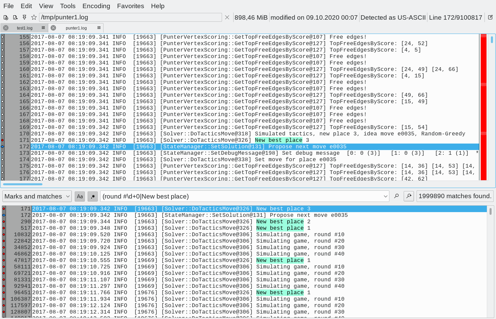

# Klogg

[](https://github.com/variar/klogg/blob/master/COPYING)
[]()
[](https://github.com/variar/klogg/graphs/contributors/)
[](http://makeapullrequest.com)
[](https://www.codacy.com/manual/variar/klogg?utm_source=github.com&amp;utm_medium=referral&amp;utm_content=variar/klogg&amp;utm_campaign=Badge_Grade)


[](https://github.com/variar/klogg/releases/)
[ ](https://github.com/variar/klogg/releases/tag/v20.12)

[](https://repology.org/project/klogg/versions)

Check [GitHub releases](https://github.com/variar/klogg/releases/latest) for Windows installers and Linux/Mac packages.

Development status

[](https://github.com/variar/klogg/milestone/8)
[](https://github.com/variar/klogg/issues?q=is%3Aopen+is%3Aissue+label%3A%22status%3A+ready+for+testing%22)
[](https://github.com/variar/klogg/commits/)
[](https://github.com/variar/klogg/actions/workflows/ci-build.yml)

[](https://img.shields.io/discord/838452586944266260?label=Discord&style=flat) [](https://gitter.im/klogg_log_viewer/community?utm_source=badge&utm_medium=badge&utm_campaign=pr-badge&utm_content=badge)

## Overview

Klogg is a multi-platform GUI application that helps browse and search
through long and complex log files. It is designed with programmers and
system administrators in mind and can be seen as a graphical, interactive
combination of grep, less, and tail.



Please refer to the
[documentation](DOCUMENTATION.md)
page for how to use Klogg.

### Latest testing builds

| Windows | Linux | Mac |
| ------------- |------------- | ------------- |
| [continuous-win](https://github.com/variar/klogg/releases/tag/continuous-win) | [continuous-linux](https://github.com/variar/klogg/releases/tag/continuous-linux) | [continuous-osx](https://github.com/variar/klogg/releases/tag/continuous-osx) |

## Table of Contents

1. [About the Project](#about-the-project)
1. [Installation](#installation)
1. [Building](#building)
1. [How to Get Help](#how-to-get-help)
1. [Contributing](#contributing)
1. [License](#license)
1. [Authors](#authors)

## About the Project

Klogg started as a fork of [glogg](https://github.com/nickbnf/glogg) - the fast, smart log explorer in 2016.

Since then it has evolved from fixing small annoying bugs to rewriting core components to
make it faster and smarter that predecessor.

Development of klogg is driven by features my colleagues and I need
to stay productive as well as feature requests from users on Github and in glogg mailing list.

Latest news about klogg development can be found at https://klogg.filimonov.dev.

### Comparing with glogg

Klogg has all best features of glogg:

* Runs on Unix-like systems, Windows and Mac thanks to Qt5
* Is fast and reads the file directly from disk, without loading it into memory
* Can operate on huge text files (10+ Gb is not a problem)
* Search results are displayed separately from original file
* Supports Perl-compatible regular expressions
* Colorizes the log and search results
* Displays a context view of where in the log the lines of interest are
* Watches for file changes on disk and reloads it (kind of like tail)
* Is open source, released under the GPL

And on top of that klogg:

* Is heavily optimized using multithreading and SIMD
* Supports many common text encodings
* Detects file encoding automatically using [uchardet](https://www.freedesktop.org/wiki/Software/uchardet/) library (supports utf8, utf16, cp1251 and more) 
* Can limit search operations to some part of huge file
* Allows to conifugure several highlighters sets and switch between them
* Has a scratchpad window for taking notes and doing basic data transformations
* Provides lots of small features that make life easier (closing tabs, copying file paths, favorite files menu, etc.)

Here is a small demo showing how much faster klogg is (searching in ~1Gb file stored on tmpfs):

https://user-images.githubusercontent.com/1620716/117588567-bea39100-b12c-11eb-990a-90a667bcaeaa.mp4

List of glogg issues that have been fixed/implemented in klogg can be found [here](https://github.com/variar/klogg/discussions/302).


**[Back to top](#table-of-contents)**

## Installation

This project uses [Calendar Versioning](https://calver.org/). For a list of available versions, see the [repository tag list](https://github.com/variar/klogg/tags).

### Current stable release builds

Current release is 20.12. Binaries for all platforms can be downloaded from GitHub releases.

[ ](https://github.com/variar/klogg/releases/tag/v20.12)

#### Windows
Windows installer is also available from Chocolatey:

[ ](https://chocolatey.org/packages/klogg)

#### Mac OS
Package for Mac can be installed from Homebrew

[ ](https://formulae.brew.sh/cask/klogg)

#### Linux
It is recommended to use klogg package from distribution-specific [repositories](https://repology.org/project/klogg/versions).

Generic packages are available from klogg DEB and RPM repositories hosted at JFrog Artifactory.
They are built to run on Ubuntu 16.04 and Centos 8 (x86-64 only).

For DEB add klogg artifactory repository, then install from apt:
```
echo deb [trusted=yes] https://favpackage.jfrog.io/artifactory/klogg_deb stable utils | sudo tee -a /etc/apt/sources.list
sudo apt-get update
sudo apt-get install klogg
```

For RPM create klogg repo file in `/etc/yum.repos.d/klogg-rpm.repo` with this content:
```
[Klogg]
name=Klogg
baseurl=https://favpackage.jfrog.io/artifactory/klogg_rpm/
enabled=1
gpgcheck=0
```

Then install using yum
```
sudo yum update
sudo yum install klogg
```

### Tesing builds


| Windows | Linux | Mac |
| ------------- |------------- | ------------- |
| [continuous-win](https://github.com/variar/klogg/releases/tag/continuous-win) | [continuous-linux](https://github.com/variar/klogg/releases/tag/continuous-linux) | [continuous-osx](https://github.com/variar/klogg/releases/tag/continuous-osx) |

**[Back to top](#table-of-contents)**

## Building

Please review
[BUILD.md](BUILD.md)
for how to setup Klogg on your local machine for development and testing purposes.

## How to Get Help

First, please refer to the
[documentation](DOCUMENTATION.md)
page.

You can open issues using [klogg issues page](https://github.com/variar/klogg/issues)
or post questions to glogg development [mailing list](http://groups.google.co.uk/group/glogg-devel).

## Contributing

We encourage public contributions! Please review [CONTRIBUTING.md](CONTRIBUTING.md) for details on our code of conduct and development process.

## License

This project is licensed under the GPLv3 or later - see [COPYING](COPYING) file for details.

## Authors

* **[Anton Filimonov](https://github.com/variar)**
* *Initial work* - **[Nicolas Bonnefon](https://github.com/nickbnf)**

See also the list of [contributors](https://klogg.filimonov.dev/docs/getting_involved/#contributors) who participated in this project.

**[Back to top](#table-of-contents)**
